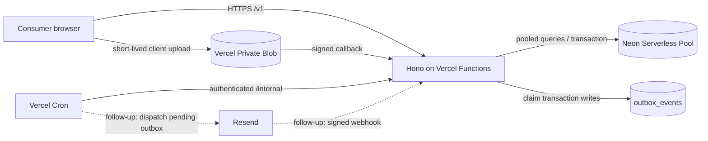

# KOI Recall 第一阶段服务端架构

## 1. 目标与交付边界

本项目是独立的消费者召回 API，不修改现有静态 Demo。第一阶段的可验收目标是把公开 Campaign、商品预筛、匿名附件上传、申请提交入库和确认邮件排队串成稳定契约。

当前仓库的六个 ToC 路由、内部任务入口、领域服务接口和供应商端口已经注册。Campaign 查询、商品预筛、匿名 Draft 创建和附件记录管理在配置 `DATABASE_URL` 后读写真实 PostgreSQL；附件直传在配置 `BLOB_READ_WRITE_TOKEN` 后接入 Vercel Private Blob（浏览器直传 + `/webhooks/vercel-blob` 完成回调）。

Claim 提交在 `DATABASE_URL`、`FIELD_ENCRYPTION_KEY` 和 `HASH_PEPPER` 三者都已配置时使用真实 `DrizzleCaseService`，成功返回 `201`。Case 聚合、Confirmation Communication 和 Outbox 在同一事务中原子持久化；响应仅承诺 `emailStatus=queued`，不表示邮件已发送或送达。未配置数据库或缺少任一 Crypto Secret 时，Claim 保持条件性 `501 application/problem+json`；非法非空配置在启动组合阶段失败关闭。

Resend 投递与 Webhook、Outbox worker、Draft cleanup、Private Blob 实体删除、Admin API 和 Vercel 部署仍未实现。仓库不写真实凭证，当前 Claim 请求也不会内联发送邮件。

## 2. 技术选型

- Node.js 24.x、TypeScript strict、pnpm。
- Hono 与 `@hono/zod-openapi`；`src/contracts/toc.ts` 是运行时校验、TypeScript 类型和 OpenAPI 的唯一契约源。
- Vercel Functions Node Runtime，独立 API 域名；生产启用 Fluid Compute 的具体配置在部署阶段确认。
- Drizzle ORM、Drizzle Kit；数据库客户端 `src/db/client.ts` 为双适配器，按 `DATABASE_URL` 主机名自动选择 Neon Serverless Pool（生产）或 node-postgres（本地），不改代码、不手工切换。Neon 必须使用 pooled connection string。
- Vercel Private Blob 浏览器直传；API 只签发短期上传权限、验证回调和关联附件。
- Resend、PostgreSQL Outbox、Vercel Cron；确认邮件与主事务解耦。
- Vitest、ESLint、Prettier。

官方能力参考：[Vercel Node.js Runtime](https://vercel.com/docs/functions/runtimes/node-js/node-js-versions)、[Vercel Hono](https://vercel.com/docs/frameworks/backend/hono)、[Private Blob](https://vercel.com/docs/vercel-blob/private-storage)、[Client Upload](https://vercel.com/docs/vercel-blob/client-upload)、[Vercel Marketplace Storage](https://vercel.com/docs/marketplace-storage)、[Neon Serverless Driver](https://neon.com/docs/serverless/serverless-driver)。

## 3. 运行时视图



生产环境只有公开的 `/v1` 和供应商要求的 `/webhooks` 入口。`/internal` 只接受 Cron Secret 或等价的服务到服务认证；它们不属于 ToC OpenAPI。

## 4. 目录与职责

```text
src/
  app.ts                         # Hono、中间件、ToC/内部路由注册
  config/env.ts                  # 环境变量解析及 CORS 通配符门禁
  contracts/toc.ts               # Zod/OpenAPI 唯一契约源
  middleware/                    # request ID、CORS、headers、rate-limit 接口
  db/
    client.ts                    # Neon Serverless Pool / node-postgres + Drizzle 工厂
    schema/index.ts              # PostgreSQL Schema
    seed.ts                      # 显式开关保护的虚构 Seed
  modules/                       # Campaign、Draft、Document、Case 等领域端口
  platform/                      # Blob、Email、Crypto、Observability 端口
  jobs/                          # Outbox/Cleanup 任务接口
  shared/                        # Problem Details 与 locale 支持
scripts/                         # OpenAPI 生成与漂移检查
drizzle/                         # SQL migration 与 Drizzle metadata
openapi/                         # 代码生成的 ToC OpenAPI 3.1
```

依赖方向是 `route -> domain service -> repository/provider port`。领域模块不得直接读取 Vercel 或 Resend 环境变量；供应商实现集中在 `platform/`，便于测试和替换。

## 5. 请求与数据流

### 5.1 公开 Campaign

1. 按 `slug` 读取 `active` Campaign 和其 `published_version_id`。
2. 从该版本读取英文本地化、商品/Lot、补救、附件要求。
3. 生成基于 Campaign 版本的 ETag，响应 `Content-Language`。
4. 只返回公开字段；不返回数据库内部 UUID 之外的存储标识或管理状态。一次性上传授权可返回受限
   pathname，供浏览器与短期 client token 一起使用。

首版请求只接受 `en-US`。表结构允许直接插入 `es-US`；以后启用语言时更新契约和内容，不需要迁移数据库。

### 5.2 商品预筛

请求中的 shape、flavor、lotCode、dateCode 与已发布版本比较，结果为 `potential_match`、`not_matched` 或 `manual_review`。结果是引导信息，不替代 Case 事务中的最终验证。

### 5.3 Draft 与附件

1. 创建短期 `claim_drafts`，令牌只返回一次，库内只保存规范化哈希。
2. 上传授权端点验证 Draft、Campaign 版本和附件规则。
3. 服务端为唯一 pathname 签发短期 Client Upload token；浏览器用 `put(pathname, file, { token })`
   直传，文件不经过 Node Function。
4. 回调验证签名、MIME、大小和 Blob 元数据，保存 Provider 最终 pathname，并更新
   `document_uploads`；失败事件保持可重试。
5. 提交前删除只把记录转为 `deletion_pending`；后台任务删除 Private Blob 和记录。

Private Blob 的任何读取都必须经过授权服务端代理或签名 URL。日志和普通 API 响应不得暴露
`storage_pathname`；唯一例外是一次性上传授权返回的受限 pathname，前端不得记录或持久化。

### 5.4 Case 提交事务

提交服务先做幂等检查，然后重新验证 Campaign 版本、Draft 状态、产品、补救、附件数量/类型/状态和事故条件字段。一个 Neon 非交互事务内完成：

1. 创建 `recall_cases` 和 `case_consumers`。
2. 创建 `claimed_products`、`case_consents`、`submission_snapshots`。
3. `incidentAnswer=yes|unsure` 时创建 `incidents` 与默认 `pending` 的 `reportability_reviews`。
4. 原子关联 `document_uploads`。
5. 追加 `case_events`。
6. 创建 `communications` 和确认邮件 `outbox_events`。
7. 保存 `idempotency_records` 的原始成功响应。

事务提交后立即返回 `201` 与不可猜测的 `caseReference`，邮件状态为 `queued`。确认页只使用本响应，不提供公开 Case GET。

### 5.5 邮件与 Webhook

当前事务只创建 `communications` 和 `outbox_events`，不调用 Resend。后续 Outbox worker 才会领取到期事件、有限重试投递并保存 Provider ID；后续 Resend Webhook 需验证签名、去重并更新 `communications`。当前 `/internal/jobs/outbox` 与 `/webhooks/resend` 均返回 `501`。

因此申请成功与邮件已发送是两个独立状态；`emailStatus=queued` 只是持久化状态。

## 6. 横切设计

### 6.1 HTTP 约定

- API 前缀 `/v1`；错误统一为 `application/problem+json`。
- 接受调用方 `X-Request-Id` 时只使用安全长度/字符，其他情况生成 UUID；所有响应回传。
- CORS 只允许 `CORS_ALLOWED_ORIGINS` 的精确 Origin，配置出现 `*` 时启动失败。
- 安全响应头由 Hono `secureHeaders` 统一添加。
- 速率限制通过接口注入；骨架使用 allow-all 实现，生产必须替换为跨实例存储。
- 日志只记录请求 ID、路由、状态、耗时和稳定错误码；邮箱、电话、地址、令牌、正文和 Blob pathname 均脱敏。

### 6.2 敏感数据

- 姓名、邮箱、电话、地址、订单号、事故叙述、收件人和提交快照使用应用层 AEAD 密文并保存 `key_version`。
- 重复检测字段使用规范化值的带 Pepper HMAC；不保存可逆明文，也不使用裸 SHA-256。
- Draft token 和 Idempotency-Key 只保存哈希。
- Blob 永远为 Private；文件名视为不可信输入，展示和日志前转义/脱敏。
- 所有密钥只来自 Vercel 加密环境变量或后续密钥管理方案，不进入 Git。
- `FIELD_ENCRYPTION_KEY` 与 `HASH_PEPPER` 用途不同、值必须不同，并与数据库/备份分开保存。
- Phase 1 只定义一种授权后台用户：由未来 Admin API 在授权后端边界内解密，允许查看/导出完整数据；不实现多级权限或字段脱敏。当前 Admin API 尚未实现。

### 6.3 异常语义

- `400`：语法、路径、查询、Header 或 JSON Schema 不合法。
- `404`：Campaign/Draft/Document 不存在或不可见。
- `409`：幂等 Key 冲突、Draft 已提交或并发状态冲突。
- `410`：Draft/上传授权已过期。
- `413`：文件超过 Campaign 限制。
- `415`：文件媒体类型不允许。
- `422`：业务规则、附件数量或事故条件字段不满足。
- `429`：限流。
- `500`：未预期错误；不回显堆栈或供应商响应。
- `503`：数据库、Blob 等必要依赖不可用。
- `501`：用于缺少必需配置的条件性能力，或已注册但尚未实现的后续能力。

## 7. Vercel 部署边界

- `src/index.ts` 导出 Hono app，由 Vercel Node Runtime 承载。
- 读写使用 Neon Serverless Pool；提交仅使用同一次请求内的非交互式事务，不把交互事务跨网络/函数保存。
- 大文件浏览器直传 Blob，避免函数请求体和执行时长成为瓶颈。
- Cron 调用必须校验 Secret，并以数据库锁/状态实现并发安全和重复执行安全。
- Preview 与 Production 使用隔离的 Neon、Blob、Resend 配置；测试 Seed 明确禁止生产执行。

上线前必须确定：生产 API 域名、CORS Origin、数据地区、数据与附件保留年限、正式 Campaign 文案、发件域名、限流阈值、文件扫描方案、密钥轮换与告警。

## 8. 当前实现状态

- 六个 ToC 路由和四个内部/回调入口完成注册。
- 运行时请求校验、CORS、Request ID、安全头、Problem Details 和 OpenAPI 可测试。
- Campaign、商品预筛、Draft、Document 记录与 Claim 提交已有 PostgreSQL 实现；Claim 另需两项合法 Crypto Secret。
- Claim 事务已持久化 Communication 与 Outbox；Resend 投递/Webhook、Outbox worker、Draft cleanup、Blob 实体删除和 Admin API 仍是后续工作。
- OpenAPI 和 Drizzle migration 均可生成和检查漂移。
