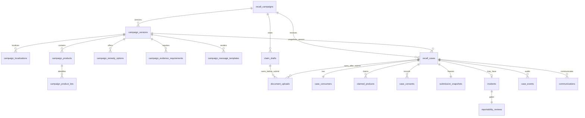

# KOI Recall 第一阶段数据库设计

## 1. 约定

- PostgreSQL/Neon，Drizzle Schema 为 `src/db/schema/index.ts`，首个生成迁移为 `drizzle/0000_adorable_sue_storm.sql`。
- 数据库客户端 `src/db/client.ts` 按连接串自动选择 Neon HTTP 或 node-postgres 驱动；`pnpm db:migrate`（`scripts/migrate.ts`）套用 `drizzle/` 迁移，本地缺失目标库时会自动创建。
- 所有实体主键使用数据库生成 UUID；对消费者展示的是不可猜测 `public_reference`，不是内部 UUID 或序号。
- 瞬时时间均为 UTC `timestamptz`；只有消费者提供的日历购买日期使用 `date`。
- 状态和稳定类别使用 PostgreSQL enum 或 check constraint；金额字段若后续增加必须使用最小货币单位整数或 `numeric`，不能使用浮点数。
- JSONB 只承载可扩展属性或事件数据，不替代需要约束、关联或查询的核心字段。

## 2. 关系概览

## 3. Campaign 与公开内容

### `recall_campaigns`

Campaign 主体。关键字段：唯一 `slug`、唯一内部 `code`、`status`、`default_locale`、指向当前发布版本的 `published_version_id`、`is_test_data`、开放/关闭时间。slug 有格式约束，关闭时间必须晚于开放时间。

### `campaign_versions`

不可变配置版本。`campaign_id + version_number` 唯一，版本号必须大于 0，状态为 `draft|published|retired`。Case 固定保存提交时版本，不跟随 Campaign 后续发布变化。

### `campaign_localizations`

复合主键 `campaign_version_id + locale`。保存标题、摘要、风险、立即行动、补救摘要、支持联系方式和 FAQ。首期 Seed 只有 `en-US`；增加 `es-US` 只插入新行。

### `campaign_products`

一个版本下的商品，`campaign_version_id + sku` 唯一。品牌、SKU、产品名是稳定字段；口味、形状等可扩展内容放在 `attributes`。

### `campaign_product_lots`

产品下的 Lot/Date Code，`campaign_product_id + lot_code + date_code` 唯一。受影响状态为 `affected|not_affected|manual_review`，为预筛和提交重验提供依据。

### `campaign_remedy_options`

补救选项，`campaign_version_id + code` 唯一；包含名称、是否需要邮寄地址、启用状态和排序。

### `campaign_evidence_requirements`

每个版本、每种附件类别唯一。保存必填标志、最小/最大数量、MIME allowlist、单文件上限和英文说明。数量和大小有 check constraint。

### `campaign_message_templates`

按版本、locale、模板类型、模板版本唯一。保存 subject、HTML/Text 内容和是否启用；`communications` 固定引用实际发送模板。

## 4. Draft 与附件

### `claim_drafts`

短期匿名草稿，保存 Campaign/版本、`token_hash`、状态、过期时间和可选的已提交 Case。没有 Save and Resume：token 仅用于上传和最终提交。`status + expires_at` 索引支持清理。

### `document_uploads`

Private Blob 元数据。保存内部 `storage_pathname`、原文件名、类别、声明/检测 MIME、大小、SHA-256、上传/扫描状态、上传/关联/过期时间。提交前由 `draft_id` 所有，提交后由 `case_id` 所有；至少一个 owner 必须存在。

重要索引与约束：pathname 唯一；`draft_id + upload_status` 支持提交校验；`case_id + category` 支持 Case 附件查询；`upload_status + expires_at` 支持孤立文件清理；大小为正；SHA-256 若存在必须是 64 位小写十六进制。

## 5. Case、消费者和事故

### `recall_cases`

Case 聚合根。关键字段：唯一且格式受约束的 `public_reference`、Campaign/版本、locale、状态、subtype、重复/事故标记、提交时间。Campaign 和版本外键使用 `restrict`，避免历史记录被配置清理破坏。

### `case_consumers`

每个 Case 唯一。姓名、邮箱、电话、地址为应用层密文；`email_lookup_hash` 和 `address_lookup_hash` 为规范化 HMAC，只用于重复检测；保存 `key_version` 支持密钥轮换。

### `claimed_products`

Case 中的一种申报商品。关联 Campaign Product，保存数量、shape、flavor、Lot/Date Code、购买渠道/日期、订单号密文与 HMAC、预筛结果。数量限制 1–100。

### `case_consents`

保存同意类型、文案版本、接受时间及最少化的 IP/User-Agent 哈希。`case_id + consent_type + text_version` 唯一，并强制 `accepted=true`。

### `submission_snapshots`

每个 Case 唯一的不可变加密提交快照，保存 Schema 版本、密钥版本、密文和明文规范化内容的 SHA-256，用于审计及验证完整性。

### `incidents`

仅在 `incidentAnswer=yes|unsure` 时创建，每个 Case 最多一个。保存事件类型、日期/未知标志、叙述密文、伤害程度、医疗处理、是否正常使用以及服务端生成的 `company_obtained_at`。`answer` 只允许 `yes|unsure`，事件类型数组不能为空；当 `unsure` 未提供类型时，应用层写入 `unknown`。日期约束在 `yes` 时由 API 强制，`unsure` 缺省日期时应用层写入 unknown 标志。

### `reportability_reviews`

每个 Incident 唯一，默认 `pending`。若变为非 pending，必须有决定时间和加密理由；`filed` 还必须有 CPSC reference 与 filed time。第一阶段不提供 B 端界面，但数据门禁先成立。

### `case_events`

Append-only 审计事件，保存 Case、事件类型、最小化 actor 信息、非敏感 JSON data 和发生时间。应用服务不允许更新或删除既有事件。

## 6. 邮件、幂等和异步处理

### `communications`

一封业务消息一行。引用 Case 与模板，`message_key` 唯一；收件人使用带密钥版本的密文。保存 `queued` 到 `delivered/bounced/failed` 的状态、Provider ID、稳定错误码和发送/送达时间。

### `outbox_events`

主事务内写入的异步事件。`deduplication_key` 唯一；保存聚合、事件类型、负载、状态、尝试次数、可执行时间、锁和处理结果。`status + available_at` 索引支持 Cron 领取。

### `idempotency_records`

按 `endpoint + key_hash` 唯一。保存请求 SHA-256、原始状态码/响应体、可选 Case 和过期时间。相同 Key/相同请求重放原响应；相同 Key/不同请求返回 `409`。不保存明文 Idempotency-Key。

### `webhook_events`

按 `provider + provider_event_id` 唯一，适用于 Resend `svix-id` 和 Blob 事件 ID。保存事件类型、处理状态、原始 JSON payload、接收/完成时间和稳定错误码，支持至少一次投递下的去重处理。

## 7. PostgreSQL enum

| Enum                          | 值                                                                                                                               |
| ----------------------------- | -------------------------------------------------------------------------------------------------------------------------------- |
| `campaign_status`             | `draft`, `scheduled`, `active`, `paused`, `closed`                                                                               |
| `campaign_version_status`     | `draft`, `published`, `retired`                                                                                                  |
| `lot_eligibility_status`      | `affected`, `not_affected`, `manual_review`                                                                                      |
| `evidence_category`           | `product_photo`, `proof_of_purchase`, `incident_evidence`                                                                        |
| `claim_draft_status`          | `active`, `submitted`, `expired`, `abandoned`                                                                                    |
| `recall_case_status`          | `submitted`, `triage`, `under_review`, `need_info`, `approved`, `rejected`, `duplicate`, `withdrawn`, `closure_review`, `closed` |
| `recall_case_subtype`         | `standard`, `injury_hazard`                                                                                                      |
| `product_check_result`        | `potential_match`, `not_matched`, `manual_review`                                                                                |
| `document_upload_status`      | `authorized`, `uploaded`, `verified`, `linked`, `rejected`, `deletion_pending`, `deleted`                                        |
| `malware_scan_status`         | `pending`, `clean`, `infected`, `failed`, `not_run`                                                                              |
| `reportability_review_status` | `pending`, `filed`, `documented_non_reportable`                                                                                  |
| `communication_status`        | `queued`, `sending`, `sent`, `delivered`, `bounced`, `failed`                                                                    |
| `outbox_status`               | `pending`, `processing`, `succeeded`, `failed`, `dead_letter`                                                                    |
| `webhook_status`              | `received`, `processing`, `processed`, `failed`                                                                                  |

## 8. 提交事务与并发约束

Case 提交在一个 Neon 非交互式事务中完成，事务内锁定/条件更新 Draft，验证它仍为 active 且未过期。顺序为 Case → Consumer/Product/Consent/Snapshot → 可选 Incident/Review → Document 关联 → Events → Communication/Outbox → Idempotency response。任一步失败都不产生半成品 Case。

上传回调、Outbox 和 Webhook 均按唯一键设计成可重试。后台清理必须以状态条件更新领取记录，不能依赖单实例内存锁。

## 9. 数据保护和保留

- 应用密文采用带认证加密并记录 `key_version`；HMAC 使用独立 Pepper。数据库、日志、Outbox payload 都不得出现上述敏感字段明文。
- `company_obtained_at`、`submitted_at`、`accepted_at` 由服务端/数据库生成，不接受消费者传值。
- 未提交 Draft 和孤立附件以 `expires_at` 清理；Idempotency 和 Webhook 记录有各自保留策略。
- Case、事故、同意、邮件和附件的正式保留年限需在上线前由法律/业务确定，清理任务必须记录审计事件。

## 10. 虚构 Seed

`src/db/seed.ts` 仅包含 `music-lollipop-demo-2026` 的英文测试数据，`is_test_data=true`。Product Photo 和 Proof of Purchase 都设为必传；Incident Evidence 可选。运行必须同时满足 `ALLOW_SYNTHETIC_SEED=true`、非 production 和已配置 `DATABASE_URL`，避免误写生产。
